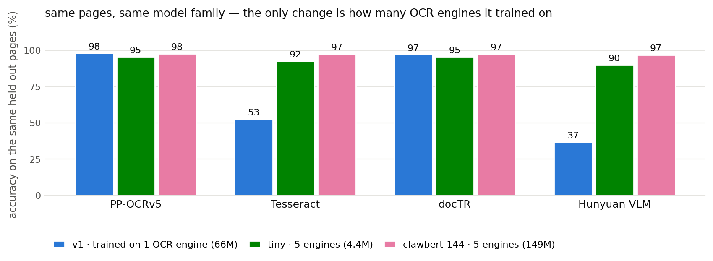
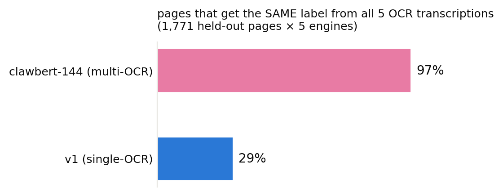

# clawbert-144

a page-type classifier for california court filings. give it the OCR text of one
page, it tells you what that page *is* — one of 11 structural types:

`body · cover_page · subsequent_cover_page · toc · toa · exhibit_cover ·
proof_of_service · verification · judicial_form · transcript · unknown_other`

i built it because i process a lot of filings and every page needs to go down a
different path: covers go to caption extraction, body pages get their margin line
numbers stripped, exhibits get their own treatment, transcripts are easy OCR.
classify first, route second. the labels also ride along as metadata, which turns
out to be the thing your RAG wishes it had.

## the one problem it actually solves

the first version of this model looked great — 98% accuracy — until i changed OCR
engines. same pages, same model: 53% on tesseract text, 37% on VLM text. it had
quietly memorized *how one OCR engine writes* (the pleading line-number rhythm)
instead of what pages say.

the fix wasn't a bigger model. it was OCRing the same 13.6k labeled pages with
**five different engines** and training on all of it:



the small model proves robustness comes from the data; the big one adds quality.
clawbert-144 gives the same page the same label no matter who transcribed it:



## specs

| | |
|---|---|
| base | ModernBERT-base, 149.6M params, full-page input (1,536 tokens, no truncation tricks) |
| trained on | ~13.6k human-labeled pages from 653 CA filings × 5 OCR engines (PP-OCRv5, Tesseract, docTR, Hunyuan VLM, Windows OCR) |
| splits | document-disjoint (no filing crosses train/test) |
| held-out test | macro-F1 0.937 · accuracy 0.974 pooled across engines (`eval/modernbert11_metrics.json`) |
| calibration | ECE ≈ 0.02 on every engine tested — the confidence is usable for triage |
| weights | on the hugging face hub (598 MB safetensors), not in this repo |

## use it

```python
from transformers import AutoTokenizer, AutoModelForSequenceClassification
import torch

repo = "REPLACE_ME/clawbert-144"
tok = AutoTokenizer.from_pretrained(repo)
model = AutoModelForSequenceClassification.from_pretrained(repo).eval()

enc = tok(page_text, truncation=True, max_length=1536, return_tensors="pt")
probs = torch.softmax(model(**enc).logits, -1)[0]
print(model.config.id2label[int(probs.argmax())], float(probs.max()))
```

or use the bundled scorer, which batches and picks a working GPU on its own:

```python
from clawbert144_infer import score_texts
labels, probs = score_texts([page1_text, page2_text])
```

## honest limitations

- scope is US/california civil filings, english, OCR text in, one page at a time.
- robustness is *demonstrated* for the five trained engines; a sixth engine is
  probably fine (that's the point of the training) but unmeasured.
- `subsequent_cover_page` is genuinely ambiguous from one page alone (F1 0.77 with
  document context, less without) — if you have whole documents, sequence models
  on top of these embeddings fix that.
- appellate materials are labeled `unknown_other` by my convention — that's a
  choice, not a failure, and it may not be your choice.
- text only. anything that's purely visual — a struck-through "[PROPOSED]", a
  signature — is invisible to it.

## license

apache-2.0, same as the base model.
