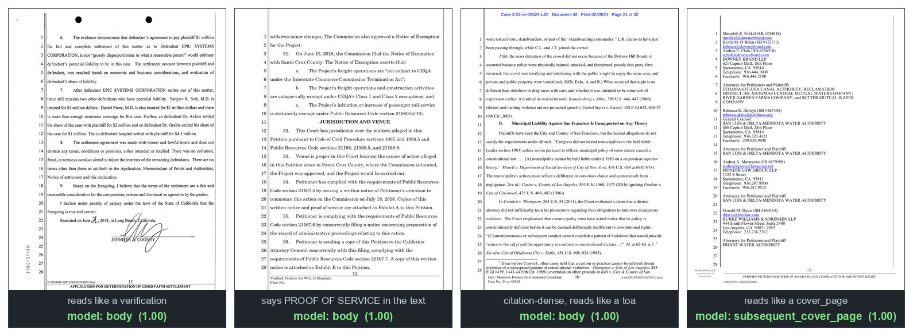

# clawbert-149

A page-type classifier for California court filings. The purpose is to route pages of a litigation filing to an OCR tailored to that page type.

Give it the OCR text of a document with page divisions, it looks at the text per page, with some info about before/after, and picks one of 11 structural types:

`body · cover_page · subsequent_cover_page · toc · toa · exhibit_cover ·
proof_of_service · verification · judicial_form · transcript · unknown_other`

One of each, straight from filed documents (individual images in
[docs/examples/](docs/examples/)):


## Not Keyword Matching

A few examples of trickier pages correctly categorized:



## What it's for

Twofold. I'd rely on it for the first but not the second:

1. **Routing pages to the right OCR.** A pleading cover page goes to a model that
   analyzes the regions and extracts critical document information; a table of
   contents goes to an OCR that recognizes the structure of the headings; a
   judicial form can go to a form-trained OCR; and so on. Classify first, route
   second.
2. **Per-page metadata for chunking.** Tell the LLM working with the text "this
   is a pleading cover page, it falls on page 1", or "this is a pleading cover
   page falling on page 17, after an exhibit cover page" — stuff like that lowers
   the risk of AI docket-context mistakes.


I initially built DistilBERT and XGBoost versions of the tool. They worked well for a single OCR type, but broke down when I fed it the same pages OCR'd by multiple engines.  The current model is trained on the same 13.6k labeled pages OCR'd by 5 very different OCR engines.

Claude made me some graphs with benchmarks showing incredible results. Because benchmarks always look to me like garbage, here is my creaky-knee-if-it's-raining estimate: I think it makes the same pick I would make about 95-96% of the time, and then maybe another percent is picks on ambiguous pages, and then 2 or 3 percent of the time it does something stupid. 

## Specs

| | |
|---|---|
| Base | ModernBERT-base, 149.6M params, full-page input (1,536 tokens) |
| Trained on | ~13.6k human-labeled pages from 653 CA filings × 5 OCR engines (PP-OCRv5, Tesseract, docTR, Hunyuan VLM, Windows OCR) |
| Splits | document-disjoint (no filing crosses train/test) |
| Held-out test | macro-F1 0.937 · accuracy 0.974 pooled across engines (`eval/modernbert11_metrics.json`) |
| Calibration | ECE ≈ 0.02 on every engine tested — the confidence is usable for triage |
| Weights | on the Hugging Face Hub (598 MB safetensors), not in this repo |

## Use it

```python
from transformers import AutoTokenizer, AutoModelForSequenceClassification
import torch

repo = "RayJackson30/clawbert-149"
tok = AutoTokenizer.from_pretrained(repo)
model = AutoModelForSequenceClassification.from_pretrained(repo).eval()

enc = tok(page_text, truncation=True, max_length=1536, return_tensors="pt")
probs = torch.softmax(model(**enc).logits, -1)[0]
print(model.config.id2label[int(probs.argmax())], float(probs.max()))
```

Or use the bundled scorer, which batches and picks a working GPU on its own:

```python
from clawbert149_infer import score_texts
labels, probs = score_texts([page1_text, page2_text])
```

## Important Limitations

- **It assumes the PDF is already one document.** It won't work on an appendix or
  a combined record — document order is a signal, especially with various
  OCRs.
- **California, probably only.** Trained on California pleadings, and California helpfully still uses the antiquated pleading line numbers. It's annoying for OCR, helpful
  for classification. I doubt it will work in other states unmodified.
- **More categories are needed and forthcoming:** appellate cover pages, and
  court-originating documents (orders, notifications, minute orders). For now
  appellate materials land in `unknown_other`.
- Robustness is demonstrated for the five trained engines; I haven't tested it on
  other OCR models.
- `subsequent_cover_page` is genuinely ambiguous from one page alone — if you
  have whole documents, sequence models on top of these embeddings fix that.
- Text only, which works so far. But also means there's stuff it will never be able to do, like deal with court stamps or signatures.

## License

Apache-2.0, same as the base model.
