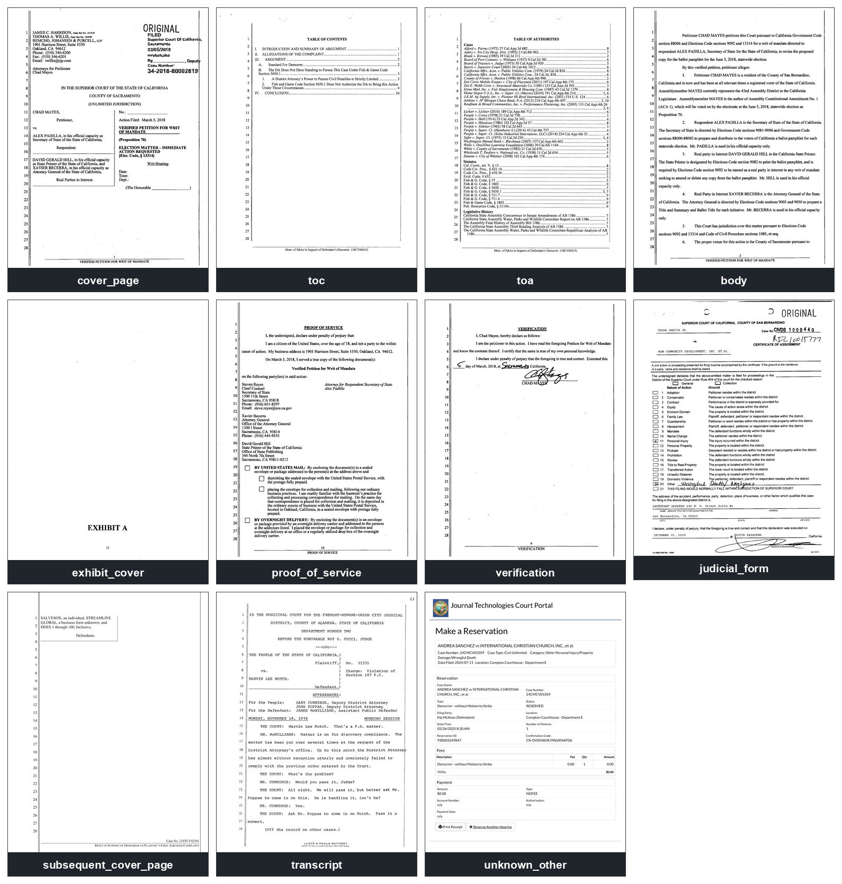
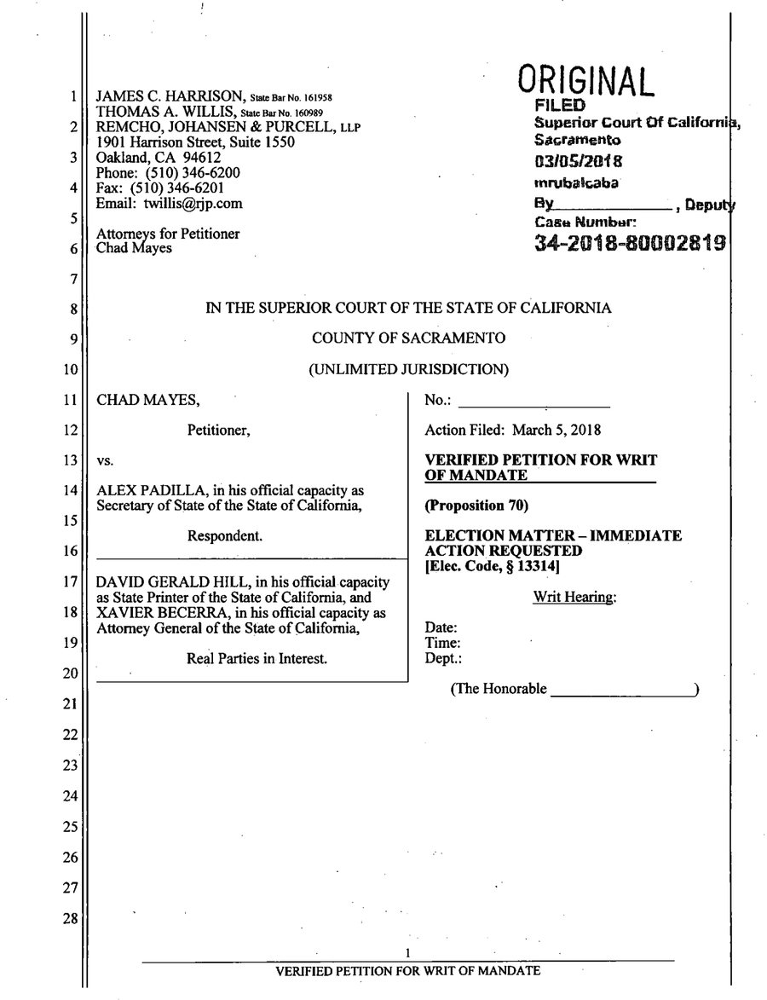

# clawbert-149

[](LICENSE)


[](https://huggingface.co/RayJackson30/clawbert-149)

A page classifier for documents filed in California state courts. Intended as a
tool to be used early in a document ingestion process, for prepping filings for
use in a RAG or even attaching to prompts. Pages are classified based on the
OCR'd text — whether Tesseract, VLM OCR, or something in between. Once
classified, they can be sent to other layout/OCR steps designed for extracting
and organizing text, and for tagging the document and its chunks. Per page-type
OCRing is outside of the scope of this tool.

11 page types:

`body · cover_page · subsequent_cover_page · toc · toa · exhibit_cover ·
proof_of_service · verification · judicial_form · transcript · unknown_other`

Exemplars (individual images in [docs/examples/](docs/examples/)):



## Purpose

1. **Routing pages to the right OCR.** A cover page goes to a model that
   extracts case metadata; a table of contents to one that reads heading
   structure; a judicial form to a form-trained OCR. This tool doesn't do any of
   this downstream work. It only classifies.
2. **Metadata for chunking.** A secondary use is tagging extracted text to help
   an LLM when working with documents. E.g., use it to tag pages of an exhibit
   as an exhibit page.

Classifying a page for OCRing and classifying a page for AI-attorney use often
overlap, but not always.

## Trained on a variety of OCR engines

Trained on about 13K pages of human-labelled page images. Each page image was
OCR'd five times, by five different OCR engines. Play around with the tabs
below — the same cover page, five very different transcriptions, one label.
Note that each page is part of a document, and the process takes into account
previous/subsequent classifications.



<details>
<summary><b>PP-OCRv5</b> &nbsp;→&nbsp; <code>cover_page</code> (1.00)</summary>

```text
ORIGINAL
1
JAMES C. HARRISON, State Bar No. 161958
FILED
THOMAS A. WILLIS, State Bar No. 160989
Superior Court Of California,
2
REMCHO, JOHANSEN & PURCELL, LLP
1901 Harrison Street, Suite 1550
Sacramento
3
Oakland, CA 94612
03/05/2018
Phone: (510) 346-6200
mnrubalcaba
4
Fax: (510) 346-6201
Email: twillis@rjp.com
By
., Deputy
5
Casa Number:
Attorneys for Petitioner
34-2018-80002819
6
Chad Mayes
7
8
IN THE SUPERIOR COURT OF THE STATE OF CALIFORNIA
9
COUNTY OF SACRAMENTO
10
(UNLIMITED JURISDICTION)
11
CHAD MAYES,
No.:
12
Petitioner,
Action Filed: March 5, 2018
13
vs.
VERIFIED PETITION FOR WRIT
OF MANDATE
14
ALEX PADILLA, in his official capacity as
Secretary of State of the State of California,
(Proposition 70)
15
Respondent.
ELECTION MATTER - IMMEDIATE
16
ACTION REQUESTED
[Elec. Code, § 13314]
17
DAVID GERALD HILL, in his official capacity
as State Printer of the State of California, and
Writ Hearing:
18
XAVIER BECERRA, in his official capacity as
Attorney General of the State of California,
Date:
19
Time:
Real Parties in Interest.
Dept.:
20
(The Honorable
21
22
23
24
25
26
27
28
1
VERIFIED PETITION FOR WRIT OF MANDATE
```
</details>
<details>
<summary><b>Tesseract</b> &nbsp;→&nbsp; <code>cover_page</code> (1.00)</summary>

```text
ran

oO fe KN DN nN FF WY NY

JAMES C. HARRISON, siate Bar No. 161958
THOMAS A. WILLIS, state Bar No. 160989
REMCHO, JOHANSEN & PURCELL, Lip
1901 Harrison Street, Suite 1550

Oakland, CA 94612

Phone: (510) 346-6200

Fax: (510) 346-6201

Email: twillis@rjp.com

Attorneys for Petitioner

ORIGINAL

FILED

Superior Court Of Californiz,

Sacramento
oz/o5/2018
mrubaicaba

By , Depu

Cage Number:

Chad Mayes 34-201 6-8000281 9g
IN THE SUPERIOR COURT OF THE STATE OF CALIFORNIA
COUNTY OF SACRAMENTO
(UNLIMITED JURISDICTION)
CHAD MAYES, No.: .
Petitioner, Action Filed: March 5, 2018

vs.

ALEX PADILLA, in his official capacity as
Secretary of State of the State of California,

Respondent.

DAVID GERALD HILL, in his official capacity
as State Printer of the State of California, and
XAVIER BECERRA, in his official capacity as
Attomey General of the State of California,

Real Parties in-Interest.

VERIFIED PETITION FOR WRIT
OF MANDATE

(Proposition 70)
ELECTION MATTER - IMMEDIATE

ACTION REQUESTED
[Elec. Code, § 13314]

Writ Hearing:
Date:
Time:
Dept.:
(The Honorable )

VERIFIED PETITION FOR WRIT OF MANDATE
```
</details>
<details>
<summary><b>docTR</b> &nbsp;→&nbsp; <code>cover_page</code> (1.00)</summary>

```text
ORIGINAL
1 JAMES C. HARRISON, State Bar No. 161958
FILED
THOMAS A. WILLIS, State Barl No. 160989
2 REMCHO, JOHANSEN & PURCELL, LLP
Superior Court Of California,
1901 Harrison Street, Suite 1550
Sagramento
3 Oakland, CA 94612
03/05/2018
Phone: (510) 346-6200
4 Fax: (510) 346-6201
mrubalcaba
Email: twillis@rjp.com
By
1 Deputy
5
Case Number:
Attorneys for Petitioner
6 Chad Mayes
34-2018-80002819
7
8
IN THE SUPERIOR COURT OF THE STATE OF CALIFORNIA
9
COUNTY OF SACRAMENTO
10
(UNLIMITED JURISDICTION)
11 CHAD MAYES,
No.:
12
Petitioner,
Action Filed: March 5, 2018
13 Vs.
VERIFIED PETITION FOR WRIT
OF MANDATE
14 ALEX PADILLA, in his official capacity as
Secretary of State of the State of California,
(Proposition 70)
15
Respondent.
ELECTION MATTER - IMMEDIATE
16
ACTION REQUESTED
[Elec. Code, S 13314]
17 DAVID GERALD HILL, in his official capacity
as State Printer of the State of California, and
Writ Hearing:
18 XAVIER BECERRA, in his official capacity as
Attorey General of the State of California,
Date:
19
Time:
Real Parties in Interest.
Dept.:
20
(The Honorable
21
22
23
24
25
26
27
28
1
VERIFIED PETITION FOR WRIT OF MANDATE
```
</details>
<details>
<summary><b>Hunyuan VLM</b> &nbsp;→&nbsp; <code>cover_page</code> (1.00)</summary>

```text
JAMES C. HARRISON, State Bar No. 161958
THOMAS A. WILLIS, State Bar No. 160989
REMCHO, JOHANSEN & PURCELL, LLP
1901 Harrison Street, Suite 1550
Oakland, CA 94612
Phone: (510) 346-6200
Fax: (510) 346-6201
Email: willis@rjp.com
Attorneys for Petitioner Chad Mayes
# ORIGINAL FILED
Superior Court Of California, Sacramento 03/05/2018 mrbalcaba By , Deputy Case Number: 34-2018-80002819
# IN THE SUPERIOR COURT OF THE STATE OF CALIFORNIA COUNTY OF SACRAMENTO (UNLIMITED JURISDICTION)
## CHAD MAYES, Petitioner, vs. ALEX PADILLA, in his official capacity as Secretary of State of the State of California, Respondent.
DAVID GERALD HILL, in his official capacity as State Printer of the State of California, and XAVIER BECERRA, in his official capacity as Attorney General of the State of California, Real Parties in Interest.
No.: __________________
Action Filed: March 5, 2018
VERIFIED PETITION FOR WRIT OF MANDATE (Proposition 70)
ELECTION MATTER - IMMEDIATE ACTION REQUESTED [Elec. Code, § 13314]
Writ Hearing: Date: Time: Dept.: (The Honorable _________________)

VERIFIED PETITION FOR WRIT OF MANDATE
```
</details>
<details>
<summary><b>Windows OCR</b> &nbsp;→&nbsp; <code>cover_page</code> (1.00)</summary>

```text
1 2 3 4 5 6 7 8 9 10 11 12 14 15 16 17 18 19 20 21 22 23 24 25 26 27 28 JAMES C. HARRISON, State Bar No. 161958 THOMAS A. WILLIS, 160989 REMCHO, JOHANSEN & PURCELL, LLP 1901 Harrison S&eet, Suite 1550 Oakland, CA 94612 Phone: (510) 346-6200 Fax: (510) 346-6201 Email: twillis@rjp.com Attomeys for Petitioner Chad Mayes ORIGINAL FILED Superior Court Of Californi Sacramento 0310512018 mrubalcaba , Depu Case Number: 34-2018-80002819 IN THE SUPERIOR COURT OF THE STATE OF CALIFORNIA COUNTY OF SACRAMENTO (UNLIMITED JURISDICTION) CHAD MAYES, Petitioner, ALEX PADILLA, in his official capacity as Secretary of State of the State of California, Respondent. DAVID GERALD HILL, in his officialeapacity as State Printer of the State of California, and XAVIER BECERRA, in his offcial capacity as Attomey General of the State of Califomia, Real Parties in Interest. Action Filed: March 5, 2018 VERIFIED PETITION FOR WRIT OF MANDATE (Proposition 70) ELECTION MATTER - IMMEDIATE ACTION REQUESTED [Elec. code, 133141 Writ Hearing: Date: Time: (The Honorable 1 VERIFIED PETITION FOR WRIT OF MANDATE
```
</details>

<br clear="right">

This model isn't intended to be used by itself. It's an early stage in a
pipeline for ultra-high-quality OCR specific to litigation documents. Examples
of different later treatment:

| page type | later treatment |
|---|---|
| `cover_page` | A VLM that pulls out the parties, filing date, and case number — and retains the artefacts. |
| `transcript` | A reader that untangles the special transcript layout. |
| `exhibit_cover` | These seem to fool VLMs, so send them to dumb OCR. |
| `body` | OCR with better reading order and heading detection — and correlate with the TOC when there is one. |
| `proof_of_service` | Keep images of the signature and the dating. |
| `judicial_form` | A model fine-tuned on the common court forms. |

## Specs

| | |
|---|---|
| Base | ModernBERT-base, 149.6M params, full-page input (1,536 tokens) |
| Trained on | ~13.6k human-labeled pages · 653 CA filings × 5 OCR engines (PP-OCRv5, Tesseract, docTR, Hunyuan VLM, Windows OCR) |
| Splits | document-disjoint — no filing crosses train/test |
| Held-out test | macro-F1 0.937 · accuracy 0.974, pooled across engines (`eval/modernbert11_metrics.json`) |
| Calibration | ECE ≈ 0.02 on every engine tested — confidence usable for triage |
| Weights | [Hugging Face Hub](https://huggingface.co/RayJackson30/clawbert-149) · 598 MB safetensors (not in this repo) |

## Use it

```python
from transformers import AutoTokenizer, AutoModelForSequenceClassification
import torch

repo = "RayJackson30/clawbert-149"
tok = AutoTokenizer.from_pretrained(repo)
model = AutoModelForSequenceClassification.from_pretrained(repo).eval()

enc = tok(page_text, truncation=True, max_length=1536, return_tensors="pt")
probs = torch.softmax(model(**enc).logits, -1)[0]
print(model.config.id2label[int(probs.argmax())], float(probs.max()))
```

Or use the bundled scorer, which batches and picks a working GPU on its own:

```python
from clawbert149_infer import score_texts
labels, probs = score_texts([page1_text, page2_text])
```

## Know what you're getting

- **Assumes one document.** Won't work on an appendix or combined record —
  document order is a signal.
- **California, probably only.** CA still uses antiquated pleading line numbers
  — annoying for OCR, but a strong classification signal. Unlikely to transfer
  unmodified.
- **More categories coming.** Appellate cover pages, and court-originating
  documents (orders, notifications, minute orders).
- **Text only.** Needs extracted text, divided by page breaks.
- **Extracted PDFs?** I think this works fine on text extracted from native
  PDFs (versus scans) but will verify soon.

## License

Apache-2.0, same as the base model.
